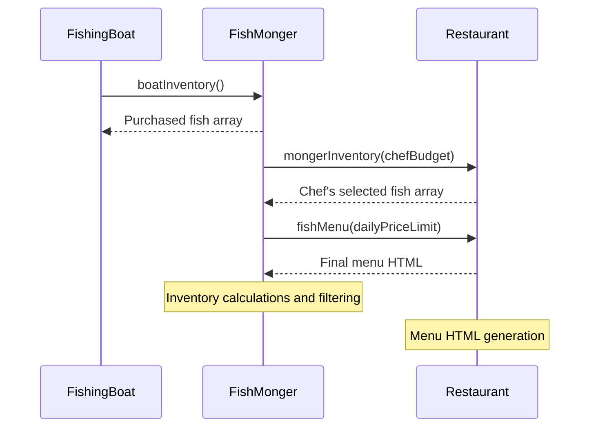

## Practice

- source https://github.com/nashville-software-school/client-side-mastery/blob/master/projects/tier-1/fish-fusion/README.md

-in progress

## Project Flow

```mermaid
sequenceDiagram
    participant FishingBoat
    participant FishMonger
    participant Restaurant

    FishingBoat->>FishMonger: boatInventory()
    FishMonger-->>FishingBoat: Purchased fish array

    FishMonger->>Restaurant: mongerInventory(chefBudget)
    Restaurant-->>FishMonger: Chef's selected fish array

    FishMonger->>Restaurant: fishMenu(dailyPriceLimit)
    Restaurant-->>FishMonger: Final menu HTML

    Note over FishMonger: Inventory calculations and filtering
    Note over Restaurant: Menu HTML generation
```